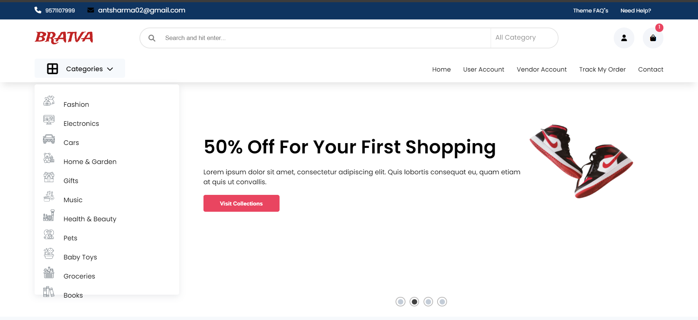
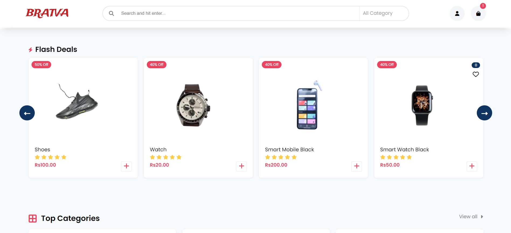
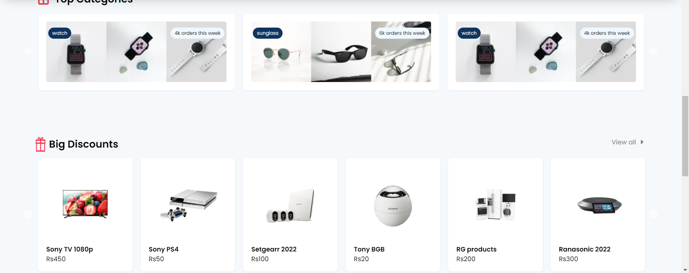
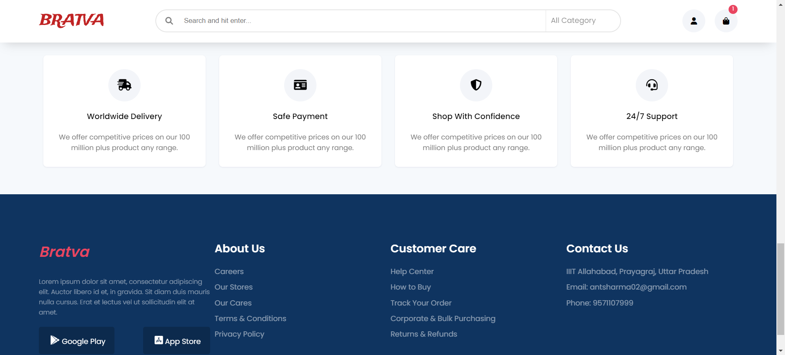
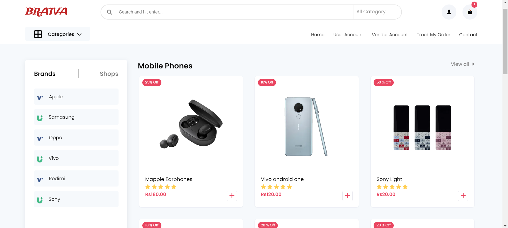
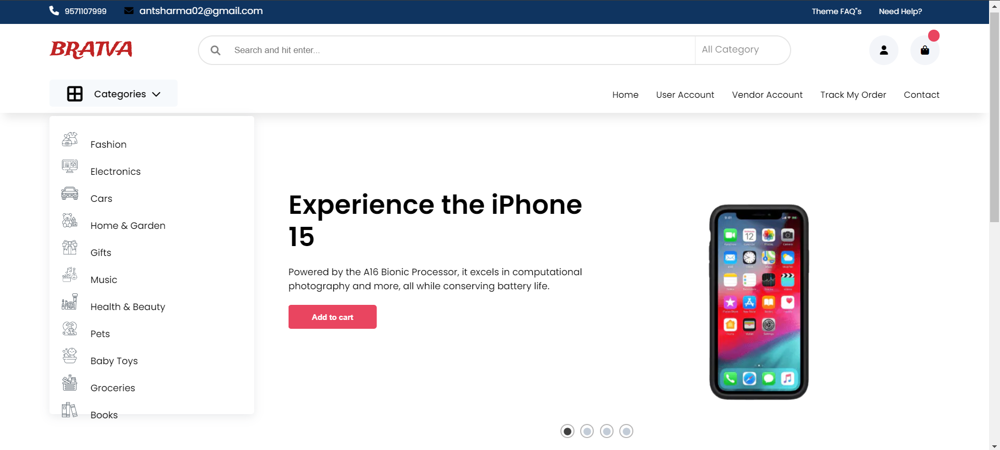

# Grull-frontend-task

Bratva is an E-commerce Website with essential commerce features. Built with React, modular and fully customizable.

Project Live link: https://grull-frontend-task.netlify.app/
## Dependencies

You need npm/yarn installed in your local machine in order to run this app.


## Tech Stack

* ReactJS
* JavaScript
* HTML
* CSS
* Netlify


## Installation


```bash
  cd Grull-frontend-task
  npm install 
  npm start
  
```
## How To Setup 
* Make sure your machine is having internet connection.
* Fork the repository.
* Open shell (which ever your OS support) on your PC.
* Change drive to the location where you want your project to be copied.
* Clone it to your local setup by using command git clone ```<repo link>```.
* Once cloned, Run the following command in the root directory of the project ```npm install```.
* After the process is completed, run the command ```npm start```.
* The website will be live on ```localhost:8080```.

## Project Structure

```
/
|-- public/			
    |-- images          #Contains images sorted into folders bifurcated according to different components
|    
|-- src/
    |-- common/              #These contains components common to everypage
        |-- Cart
        |-- footer
        |-- header  
    |  
    |-- components/
        |-- Item/                #Contains description-carousal of each product
            |--Item.css
            |--Item.jsx          #Setting layout of complete page
            |--Sdata.jsx         #Contains decription inside the product slider
            |--SlideCard.jsx     #Setting the layout of the Slidecarasoul
            |--Slider.jsx        #Calling the carousel
        |
        |-- MainPage/            #Contains description of HomePage
            |--Categories.css
            |--Categories.jsx    #Setting layout of Categories' Drop-Down list
            |--Home.jsx          #Setting layout of complete page
            |--Home.css         
            |--Sdata.js          #Contains home-carousel data
            |--SlideCard.jsx     #Setting the layout of the Slidecarasoul
            |--Slider.jsx        #Adding the carousel
        |
        |-- assets/             #contains static files such as website logo
        |
        |-- discount/           #contains layout and info about discount-deals-slider
            |--Dcard.jsx        #takes care of individual cards
            |--Ddata.js         #contains data of each discount card as a list 
            |--Discount.jsx     #Setting the overall discount section incorporating each cards
        |
        |-- flashDeals/         #Setting the flashDeals-slider section
            |--FlashCard.jsx        #takes care of individual cards
            |--FlashDeals.jsx       #Setting up the section with add to cart feature
            |--style.css     
        |
        |-- shops/              #Contains page for shopping products
            |--Catg.jsx         #Contains drop-down list companies of product category
            |--Sdata.js         #Contains data of product cards
            |--Shop.jsx         #Setting the overall shop section 
            |--ShopCart.jsx     #Setting up the individual Product cards
            |--style.css     
        |
        |-- top/           #contains layout and info about most-viewed-categories slider
            |--TopCart.jsx      #Setting up the individual Category cards in slider
            |--Tdata.js         #contains data of each card as a list 
            |--TopCate.jsx      #Setting the overall wanted categories' slider section incorporating each cards
            |--style.css
        |
        |--wrapper/             #Contains wrapper placed above footer of the page
            |--Wrapper.jsx
            |--style.css
        |
        |--pages/               #incorporating components to form complete pages 
            |--ItemPage.jsx     #forms cart's page
            |--MobilePage.jsx   #Setting up the shopping product page as per the category
            |--Pages.jsx        #Setting up the landing HomePage

        |
        |--App.css
        |--App.js
        |--index.js
|

```
## Screenshots

HOME PAGE:





CATEGORY PAGE:


PRODUCT PAGE:



